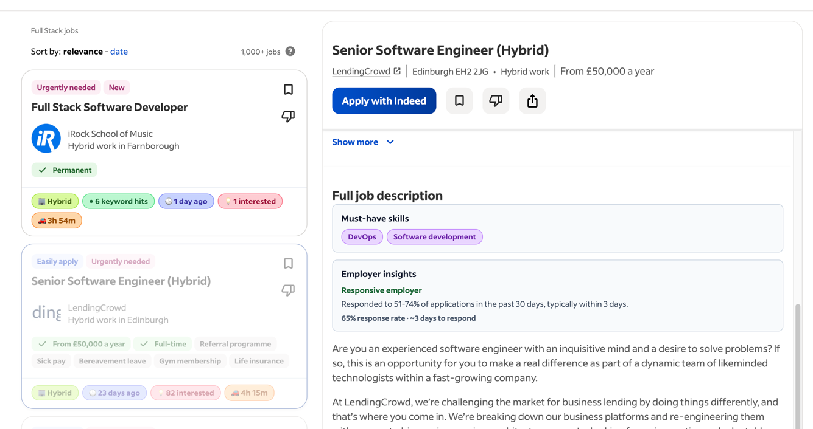
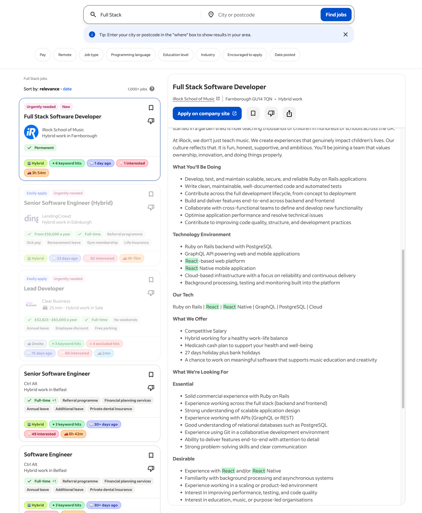
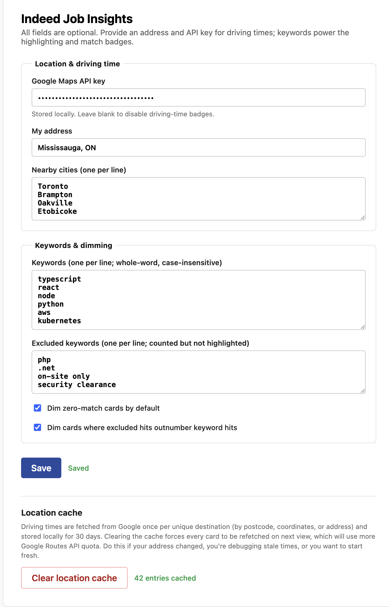
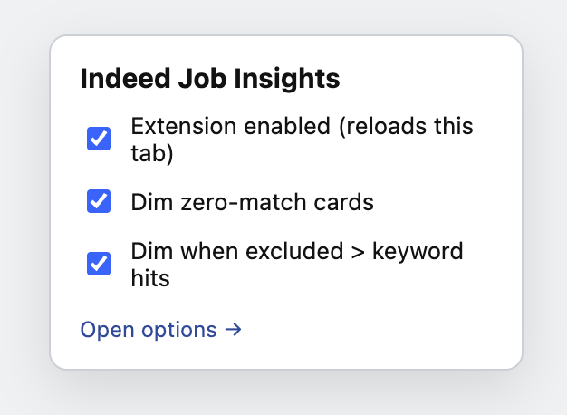
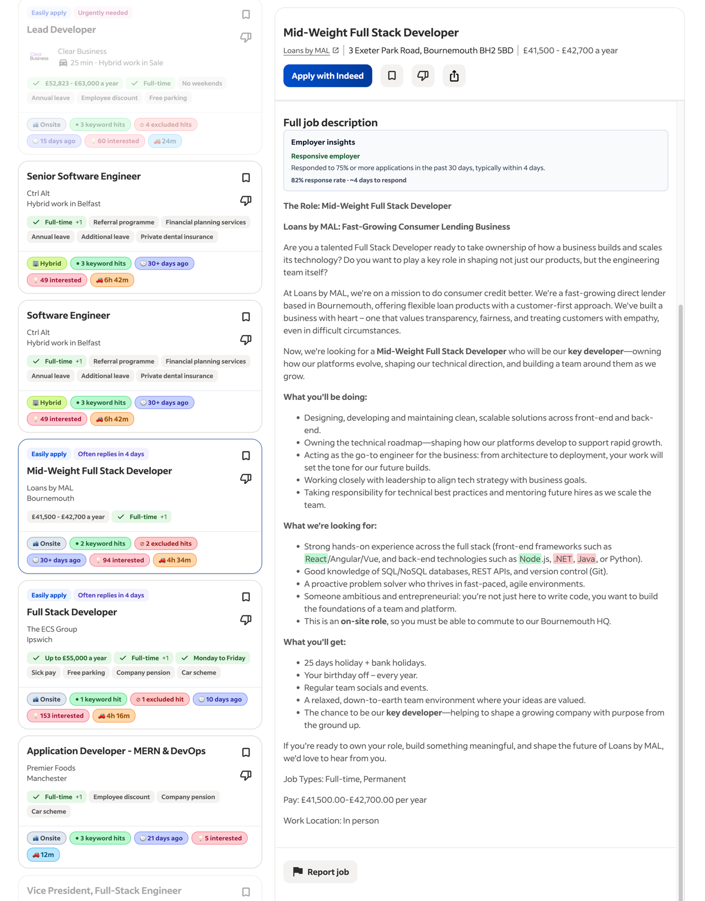

# Indeed Job Insights

A Chrome extension that decorates Indeed job listings with information that helps you triage postings faster, without clicking into every card.



## What you get

- **Driving time from your address** shown on each card (optional; needs a Google Maps API key).
- **Work mode badge** (Remote / Hybrid / Onsite) inferred from the posting.
- **City-mention pill** when the description mentions your home city or a nearby city you've listed.
- **Keyword hit count** based on your own list of keywords, with matches highlighted inline in the snippet and in the full description.
- **Excluded-keyword count** so you can see at a glance how many red-flag terms a posting contains.
- **"X interested" pill** showing how many people have started applying.
- **Posted-date pill** ("Posted today" / "5 days ago").
- **Must-have skills panel** in the detail pane, listing the skills Indeed has flagged as hard requirements.
- **Employer insights panel** in the detail pane (response rate, typical reply time).
- **Dimming** (optional) so low-relevance cards fade into the background:
  - Zero-match cards (no keyword hits, no city mention).
  - Cards where excluded keywords outnumber your keyword hits.

Everything is cached locally and rate-limited, so repeated scrolling stays fast and stays well under API free tiers. All settings are optional: install it and it works out of the box for keyword highlighting and pills; add an address and API key when you want driving times.



## Install the extension

1. Download or clone this repository.
2. In a terminal, from the project root, run:
   ```bash
   pnpm install
   pnpm build
   ```
   (You'll need Node 22+ and pnpm 10+. If you don't have pnpm: `npm install -g pnpm`.)
3. Open Chrome and navigate to `chrome://extensions`.
4. Toggle **Developer mode** on (top-right).
5. Click **Load unpacked** and select the `dist/` folder from this repo.
6. The extension is now installed. Pin it to the toolbar so you can open the popup later.

## Optional: Google Maps API key for driving times

The driving-time badge is the only feature that needs external credentials. If you don't set this up, every other feature (pills, highlights, must-have skills, employer insights, dimming) still works; cards just won't show a driving time.

1. Go to the [Google Cloud Console](https://console.cloud.google.com/).
2. Create a project (or pick one you already use).
3. Enable the **Routes API**.
4. Create an API key under *APIs & Services → Credentials*.
5. Restrict the key: under *Application restrictions* pick "HTTP referrers" and allow `https://*.indeed.com/*`; under *API restrictions* limit it to the Routes API.

Pricing: usage falls under "Compute Route Matrix Essentials". 10,000 free calls per month, then $5 per 1,000. Personal job hunting fits easily in the free tier thanks to the 30-day local cache.

## Configuring it

Click the extension icon and pick **Open options** (or right-click the icon and choose *Options*). Every field is optional; fill in what's useful to you.

**Location & driving time**
- **Google Maps API key**: paste the key from the step above. Leave blank to disable driving-time badges.
- **Your address**: full address (e.g. `1 High St, Woking, UK`) or just a city (e.g. `Mississauga, ON`). Full addresses give more accurate driving times.
- **Nearby cities** (one per line): cards whose description mentions any of these get a "…mentioned" pill.

**Keywords & dimming**
- **Keywords** (one per line): whole-word, case-insensitive matches. Highlighted in green and counted per card.
- **Excluded keywords** (one per line): highlighted in red and counted; feeds the "excluded > keyword hits" dim rule.
- **Dim zero-match cards by default**: fades cards with no keyword hits and no city mention.
- **Dim cards where excluded hits outnumber keyword hits**: on by default. Fades cards whose description contains more excluded hits than keyword hits.

**Location cache** (at the bottom of the options page)
- Shows how many driving-time entries are currently cached.
- **Clear location cache** wipes all cached driving times. Do this if your address changed, you're debugging stale times, or you want to start fresh. The next scroll will re-fetch and re-cache everything (burning a bit more of your Google quota).

Click **Save** on the main form to persist changes. Your settings stay on your machine (`chrome.storage.local`); nothing syncs to Google.

<p align="center"></p>

## The popup

Click the toolbar icon for quick toggles:
- **Extension enabled**: turn the whole thing off without uninstalling. Toggling this reloads the current tab so the change takes effect immediately.
- **Dim zero-match cards** and **Dim when excluded > keyword hits**: same as the options page, for one-click access.

<p align="center"></p>

## Using it

Open any Indeed page. The extension runs automatically on:
- `*.indeed.com/jobs` (search results).
- `*.indeed.com/` (homepage job feed).
- Any posting page or detail pane you land on from there.

As cards scroll into view, the extension fetches each posting's detail page in the background (rate-limited to one request per second so Indeed's bot protection doesn't kick in), extracts location and insight data, computes driving time via Google Maps (if configured), and renders everything as a footer inside each card. The right-hand detail pane gets the must-have skills and employer insights panels above the description.



## Tips

- **Changing your address or API key** takes effect on the next card view. Already-decorated cards keep their old driving times until the cache entry expires (30 days); use **Clear location cache** in options if you want immediate re-fetching.
- **If driving-time badges show `⚠`**, hover it for the error message (the tooltip auto-hides after a couple of seconds). Most common causes: the API key isn't valid yet (new keys take a minute to propagate), the Routes API isn't enabled, or the key's referrer restriction blocks `indeed.com`. Generic destinations like "Remote" or "United Kingdom" silently omit the badge instead of showing ⚠ because there's nothing to route to.
- **If no decorations appear**, reload the extension from `chrome://extensions` after `pnpm build`, and make sure you're on a page with job cards.
- **To pause temporarily**, use the popup's "Extension enabled" toggle.

## Privacy

- Nothing leaves your machine except:
  - Requests to Google's Routes API with your address and each listing's location (only when you've configured an API key).
  - Requests to Indeed's own `/viewjob` endpoint (the same one your browser would hit if you clicked the card).
- Your API key, address, keywords, cities, toggle state, and cached driving times are stored in `chrome.storage.local`. Nothing is synced across devices.

## Known Limitations

- It can get hit by Cloudflare to prevent against bot traffic. I've tried throttling job description fetch endpoint, but it's not enough to prevent this. A sophisticated solution like rotating residential proxies perhaps can help. However, I've no intention of dealing with proxy complexity yet. For my personal use-case, I can manage it by being slow and remaining under the detection limits. PRs, however, are welcome with better solutions to address this. 

---

Built with ❤️ and [Claude Code](https://claude.com/claude-code).
